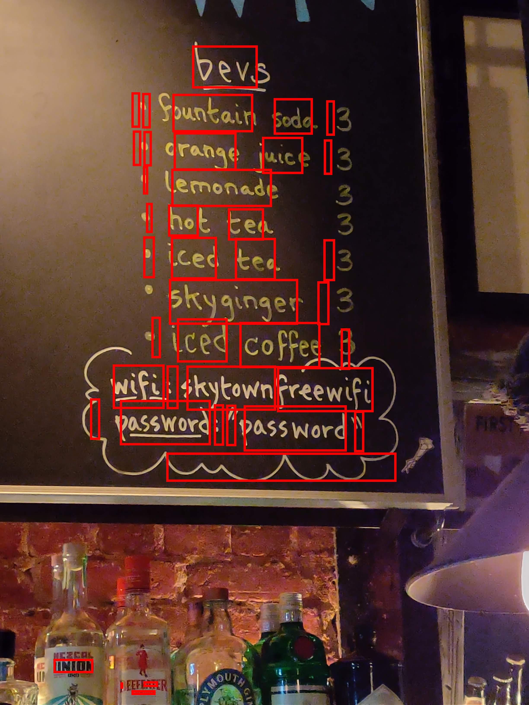

# CafeWifiCapture

Imagine you are in a crowded coffee shop and you're ready to pay for your order. After paying you ask for the wifi, and the cashier gestures to a small blackboard easel on the counter. You open this app, take a picture, and you are instantly logged in to the correct network, and the credentials are saved in your phones network settings.

My current state is this:

I made a Python script that authenticates with the google cloud vision api, and can make requests with it. I have fed it an example image provided by google to test it out, and it works great on that. (This API stuff took me forever to figure out but in the process, I learned about the http protocol, the http header, body, and that its just a json object. I learned how OAuth2 works and why it bounces back and forth so many times (so 3rd parties can log you in), and I learned how to use curl to make http requests manually! I used this tool to save my API response (which contained the token) in a json file. After looking at that file, it was easy to see how I could parse out all the info Google detected in my image. However, Google did email me the next day to tell me they found the token in my public repo and said that it was a very bad idea.

## Original Plan:

Make a little script to draw bounding boxes on the letters, words, and blocks etc and show the confidence and label. It seems irrelavent, but this will get me familiar with how Google vision sees, and it will give me a chance to learn different ways of manipulating image data.

Learn how computers find and authenticate with routers and wifi and all that jazz.

Make a process for finding the network name and password in the jumble of words on the back of a router or near a menu etc.

Make a process for using the words detected in the picture for logging into a network

## Current Progress:

#### Did 
* I've finished the bounding box scripts which will make it easy for me to see what the google api is thinking. I have optional boxes for the paragraphs, words, and letters, all of different colors. 

#### Learned
* It turns out google's vision model does not match the bounding box corners up in a rectangle. So I ended up just parsing out opposite corners and drawing my box based on that. 
* To draw these boxes, I wanted to break it down to the byte code of the image, but after looking at a few images in base64 and in hex, I decided the jpg and png styles were different enought that I would not have time this round to account for all file types. 
* I ended up using Python Image Library to read the pixel values in, change the ones I needed, then write that data to a new file. Reading and writing is super slow though, so instead of reading the pixel values in, I kept it as an PIL.Image object. In reading about this class, I found a method to change pixel values way more easily. I could also render the image without saving it to disk this way.

#### Did 
* I'm now working on a way to organize the words to easily pair the words together, so we know which is the network name and which is the password. It may be easier to pick a few good options and try every combination.

#### Learned
* Google vision is not perfect, so we need a way to check a few close options in the case that a perfect match is not found
* Similarity is kind of subjective. I went with a definition that that counts the number of letters that match in-order and represents that number as a fraction of the total number of *implied* letters. This just means that if the strings are different in length, we'll represent the empty spaces of the smaller one as letters that do not match. 
* I did this because sometimes Google vision misrepresents a letter like '0' instead of 'o'. If we were just counting matched letters out of total letters, the pair (hello, hell) would have a higher score than (hello, hell0), but the second pair is clearly more similar. In addition, sometimes you've got names like NETGEAR411 and NETGEAR411-5G. Those have different meaning, so empty spaces count against correctness. 

#### Doing
* Working on a process that finds the password. Since authenticating and signing into a network is so slow, I can't just check every word with every network name. That would take hours. So I need a way to find the password with great certainty.

#### Learning
* considering options like: Letting a machine learning model look at the placements and values of the words in the image to determine the password. Letting an ML model look at all the words and learning what a password usually looks like. Making a search algorithm to locate keywords like "password" or "pw" and look for words in a certain position relative to those words (like to the right of, or below)

